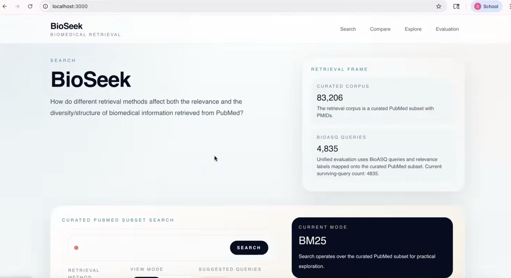
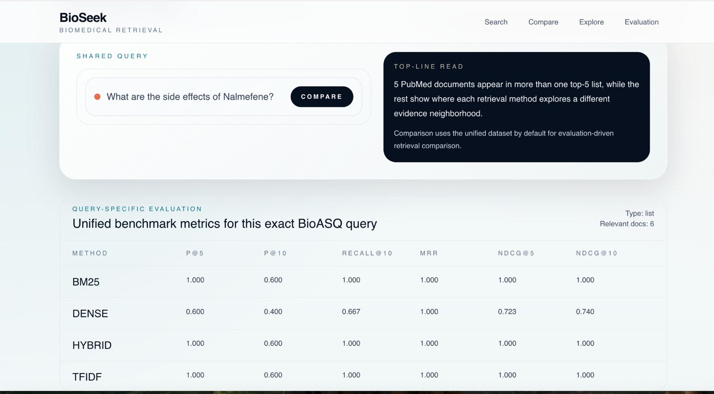
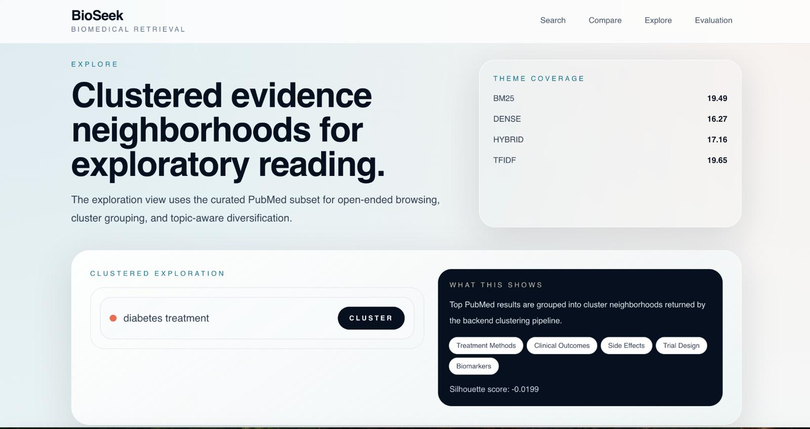
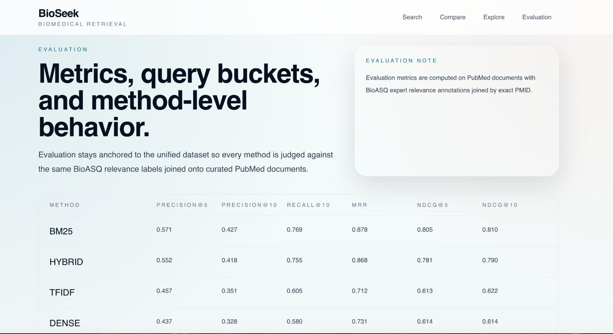

# BioSeek: Analyzing Retrieval Methods and Evidence Structure in Biomedical Search

## 🚀 Quick Access (Start Here)

- **Main Deliverable Notebook:** `main_notebook.ipynb`  
- **Project Detailed Demo Video:** https://youtu.be/qsRDyH1-u4E <br>
- **Project Introduction Video (Canvas Submission):** https://youtu.be/5AcG82p8YiA


## 1. Project Overview

Biomedical literature is growing at an unprecedented scale, making it increasingly difficult for researchers and practitioners to efficiently locate relevant and comprehensive evidence. Traditional information retrieval (IR) systems are typically evaluated using relevance-based metrics such as Precision@k, Recall, MRR, and nDCG. However, these metrics do not capture how different retrieval methods influence the *structure*, *diversity*, and *interpretability* of the returned information.

This project, **BioSeek**, investigates how different retrieval paradigms like lexical (TF-IDF, BM25), dense semantic retrieval, and hybrid approaches, affect not only retrieval accuracy but also the organization and breadth of biomedical knowledge surfaced to users. The goal is to move beyond relevance and analyze how retrieval systems shape the evidence landscape itself.


| Search Interface | Compare View |
|-----------------|-------------|
|  |  |

---

| Explore (Clustering) | Evaluation Dashboard |
|----------------------|---------------------|
|  |  |


## 2. Research Questions

Primary Research Question
How do different retrieval methods impact both the effectiveness and the structure of biomedical information retrieval?

Sub-questions

1. Which retrieval method performs best under standard IR evaluation metrics (e.g., Precision@k, Recall, nDCG, MRR)?
2. Do higher relevance scores correspond to broader and more diverse evidence coverage?
3. How do lexical, dense, and hybrid retrieval methods differ in how they organize and structure retrieved biomedical information?


## 3. Dataset and Processing

### Datasets Used

- **BioASQ Task B Dataset**  
  Biomedical queries with expert-annotated relevance judgments  
  Source: https://bioasq.org/

- **Curated PubMed Subset**  
  Biomedical abstracts with PMID identifiers  
  Source: https://pubmed.ncbi.nlm.nih.gov/

### Data Alignment

- Queries and relevance labels are aligned with PubMed documents using **PMID-based joins**
- Only exact matches are retained to ensure consistency between retrieval and evaluation

### Preprocessing

- Text normalization and cleaning  
- Tokenization for lexical retrieval  
- Embedding generation for dense retrieval  
- Index construction for each retrieval method  


## 4. Results Summary

Retrieval methods influence not only *what* documents are retrieved, but *how biomedical knowledge is structured and explored*.  

- Lexical methods (TF-IDF, BM25) produce more precise but narrower results  
- Dense and hybrid methods improve recall and generate more semantically coherent and diverse evidence  

This highlights the importance of evaluating retrieval systems beyond traditional relevance metrics.


## 5. Repository Structure

```text
.
├── README.md
├── DEMO_NOTES.md
├── REPORT_NOTES.md
├── backend/
│   ├── app/
│   ├── requirements.txt
│   └── tests/
├── checkpoints/
│   ├── 637004205_ProjectCheckpoint1_CS676.ipynb
│   └── 637004205_Project_Checkpoint2_CS676.ipynb
├── docs/
│   ├── architecture.md
│   ├── clustering.md
│   ├── dense_adaptation.md
│   └── project_story.md
├── frontend/
│   ├── app/
│   ├── components/
│   ├── lib/
│   ├── public/
│   └── package.json
├── notebooks/
│   ├── 05_query_type_analysis.ipynb
│   ├── 06_diversity_analysis_dense.ipynb
│   └── README.md
├── scripts/
│   ├── analyze_diversity.py
│   ├── analyze_query_types.py
│   ├── build_retrieval_indexes.py
│   ├── cluster_retrieval_results.py
│   ├── compare_adapted_dense.py
│   ├── evaluate_retrieval.py
│   ├── join_pubmed_bioasq.py
│   ├── load_bioasq_taskb.py
│   ├── prepare_pubmed_subset.py
│   ├── run_dense_clustering_debug.py
│   ├── run_test_queries.py
│   └── train_adapted_dense.py
└── shared/
    └── config/
```

## What Each Folder Contains

- `checkpoints/`: the two checkpoint notebooks submitted earlier in the semester
- `notebooks/`: supporting exploratory and analysis notebooks used during development
- `scripts/`: data preparation, retrieval, evaluation, and analysis scripts
- `backend/`: FastAPI backend for search, comparison, analysis, and dataset endpoints
- `frontend/`: Next.js frontend for demonstrating the search and comparison workflow
- `docs/`: supporting writeups on architecture, clustering, dense retrieval, and project framing
- `shared/config/`: shared configuration used across backend and frontend pieces

## 6. How To Reproduce The Work
### Dataset & Evaluation Files

Due to the large size of the processed dataset and evaluation artifacts, they are not included directly in this repository.  

You can download them from the following link:  
[Download Data & Evaluation Files](https://drive.google.com/drive/folders/1UlYyxLGghrMv3ZLSC2R-61kkyq0tsCrl?usp=sharing)

After downloading:
- Place the files in the root directory of the cloned repository
  
### Notebook Reproduction

1. Open `main_notebook.ipynb`.
2. Install the dependencies listed in `backend/requirements.txt`.
3. Run the notebook cells in order.
4. Use the supporting scripts in `scripts/` if you need to rebuild processed data or retrieval indexes.

### Web Application 
#### Backend

```bash
cd backend
python3 -m venv .venv
source .venv/bin/activate
pip install -r requirements.txt
uvicorn app.main:app --reload
```

#### Frontend

```bash
cd frontend
npm install
npm run dev
```

## Key Dependencies And Versions

- `Python Version== 3.12`

Important Python dependencies currently tracked in `backend/requirements.txt` include:

- `fastapi==0.115.6`
- `uvicorn[standard]==0.32.1`
- `scikit-learn==1.6.0`
- `sentence-transformers==5.4.1`
- `torch==2.9.0`
- `faiss-cpu==1.13.2`
- `pandas==3.0.2`
- `pyarrow==23.0.1`
- `datasets==3.2.0`

Important frontend dependencies currently tracked in `frontend/package.json` include:

- `next==14.2.15`
- `react==18.3.1`
- `react-dom==18.3.1`
- `tailwindcss==3.4.17`
- `typescript==5.7.2`


## Main Scripts

- `scripts/load_bioasq_taskb.py`: loads BioASQ Task B questions and labels
- `scripts/prepare_pubmed_subset.py`: prepares the curated PubMed subset
- `scripts/join_pubmed_bioasq.py`: joins BioASQ and PubMed by PMID
- `scripts/build_retrieval_indexes.py`: builds retrieval indexes
- `scripts/evaluate_retrieval.py`: computes retrieval evaluation metrics
- `scripts/analyze_query_types.py`: analyzes retrieval behavior by query type
- `scripts/analyze_diversity.py`: analyzes diversity across methods
- `scripts/cluster_retrieval_results.py`: clusters retrieved results for structural analysis

## Main API Routes

- `GET /api/health`
- `POST /api/search`
- `POST /api/compare`
- `POST /api/clusters`
- `POST /api/query-analysis`
- `GET /api/metrics/summary`
- `GET /api/query-types/summary`
- `GET /api/metrics/examples`
- `GET /api/diversity/summary`
- `GET /api/dataset-info`
- `POST /api/ai-polish`
